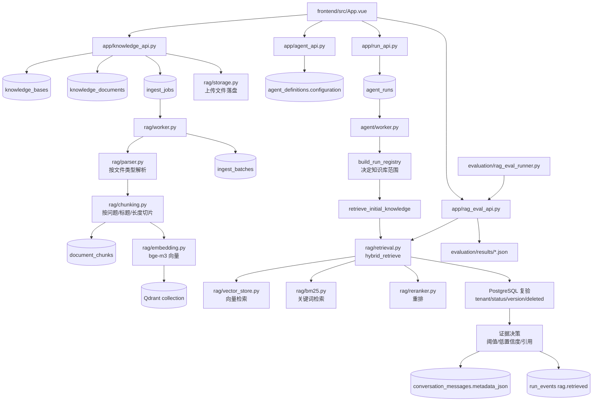
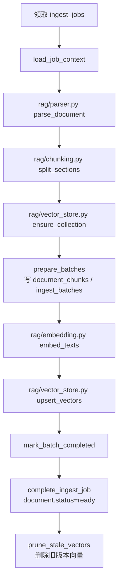
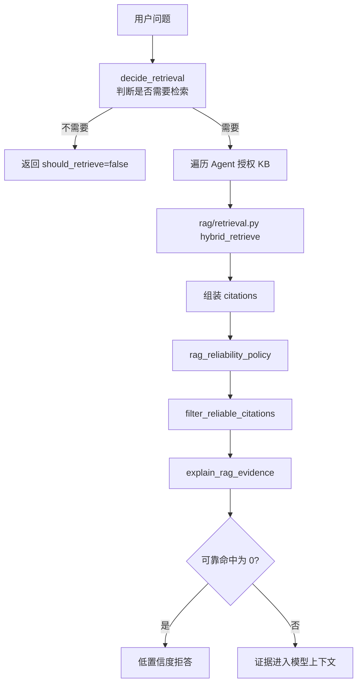
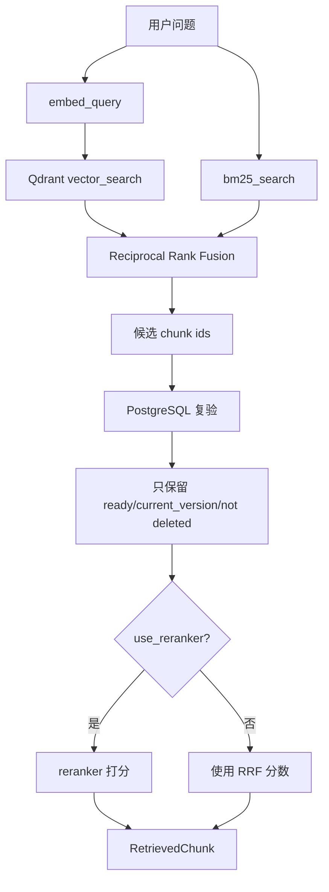

# RAG 代码流程阅读图

这份文档用于第二天按代码理解 RAG。它把“上传入库”“检索回答”“eval 验证”“删除清理”四条线串起来。

## 总览图



## 1. 数据模型先看这里

文件：`infrastructure/models.py`

核心表：

- `KnowledgeBase`
  - 一条知识库。
  - 关键字段：`name`、`scope`、`collection_name`。
  - `collection_name` 对应 Qdrant collection。

- `KnowledgeDocument`
  - 一份上传文档。
  - 关键字段：`knowledge_base_id`、`filename`、`storage_path`、`content_hash`、`current_version`、`status`、`deleted_at`。
  - `current_version` 用来判断当前有效版本。
  - `deleted_at` 不为空时，检索必须排除。

- `DocumentChunk`
  - 文档切片元数据，正文存在 PostgreSQL，向量存在 Qdrant。
  - 关键字段：`document_id`、`document_version`、`chunk_index`、`text`、`token_count`、`source_page`、`metadata_json`。
  - `source_page` 目前 PDF 可有页码，md/docx 可能为空。

- `IngestJob`
  - 一次文档入库任务。
  - 关键字段：`document_id`、`document_version`、`status`、`completed_chunks`、`total_chunks`、`lease_owner`、`lease_until`。
  - 支持 worker 崩溃恢复和重试。

- `IngestBatch`
  - 入库批次。
  - 防止重试时重复 upsert 同一批向量。

## 2. 创建知识库和上传文档

入口：`app/knowledge_api.py`

### 创建知识库

接口：

```text
POST /api/knowledge/bases
```

做的事：

1. 写 `knowledge_bases`。
2. 生成独立 `collection_name`。
3. 写审计日志。

关联：

- 表：`knowledge_bases`
- 后续向量库：Qdrant collection 使用 `collection_name`

### 上传文档

接口：

```text
POST /api/knowledge/bases/{knowledge_base_id}/documents
```

做的事：

1. 校验知识库属于当前租户。
2. `rag/storage.py` 保存上传文件。
3. 计算内容 hash。
4. 创建或更新 `knowledge_documents`。
5. 创建 `ingest_jobs`。
6. 返回入库任务状态。

重点：

- 相同内容不会重复创建可检索 chunk。
- 文档版本通过 `current_version` 控制。
- 真正解析和向量化不在 API 里做，而是交给 `rag-worker`。

## 3. RAG Worker 入库链路

入口：`rag/worker.py`



关键文件：

- `rag/parser.py`
  - 按文件类型解析：txt/md/html/pdf/docx/xlsx。
  - PDF 会按页提取，所以能带 `source_page`。
  - Markdown 会按问题标题拆 section。
  - HTML 会按 `h1` 到 `h6` 拆 section。
  - Word 会按 Heading/标题样式拆 section。

- `rag/chunking.py`
  - 把 ParsedSection 切成 chunk。
  - 题库类 markdown 优先保持问题和答案边界。
  - 输出 `chunk_index`、`text`、`token_count`、`source_page`、`metadata`。

- `rag/embedding.py`
  - 加载 embedding 模型。
  - `embed_texts()` 批量生成向量。
  - `embed_query()` 给用户问题生成向量。

- `rag/vector_store.py`
  - 管 Qdrant。
  - `ensure_collection()` 创建 collection。
  - `upsert_vectors()` 写向量。
  - `search_vectors()` 查向量。
  - `delete_document_vectors()` / stale cleanup 删除旧向量。

- `rag/ingest_utils.py`
  - `stable_chunk_id()` 生成稳定 chunk id。
  - 防止 worker 重试造成重复向量。

## 4. Agent 如何决定查哪个知识库

入口：`agent/worker.py`

先看：

```text
build_run_registry()
```

Agent 的知识库配置来自：

```text
agent_definitions.configuration
```

前端创建 Agent 时写入：

- `knowledge_scope = none`
  - 不启用知识库。
- `knowledge_scope = global`
  - 当前租户所有知识库都可查。
- `knowledge_scope = custom`
  - 只查 `knowledge_base_ids` 指定的多个知识库。

`build_run_registry()` 会：

1. 读 Agent 配置。
2. 算出 `knowledge_base_ids`。
3. 注册工具白名单。
4. 如果启用 RAG，允许 `search_knowledge`。

## 5. Agent 对话里的 RAG 检索链路

入口：`agent/worker.py`

重点函数：

```text
retrieve_initial_knowledge()
```

流程：



这里产出三类东西：

- `context_citations`
  - 给模型上下文用。
- `display_citations`
  - 给前端展示用。
- `retrieval_info`
  - 给事件流、metadata 和低置信度判断用。

## 6. hybrid_retrieve 内部做什么

入口：`rag/retrieval.py`

重点函数：

```text
hybrid_retrieve()
```

流程：



为什么要 PostgreSQL 复验：

- Qdrant payload 不作为最终可信来源。
- 必须重新确认：
  - `tenant_id` 一致
  - 文档 `status == ready`
  - `deleted_at is None`
  - chunk 的 `document_version == document.current_version`

返回结果会带：

- `chunk_id`
- `document_id`
- `text`
- `source_page`
- `section_label`
- `heading`
- `sheet`
- `score`
- `knowledge_base_id`
- `knowledge_base_name`
- `knowledge_base_scope`
- `filename`
- `document_version`
- `current_version`
- `retrieval_stage_ms`
- `retrieval_total_ms`

## 7. 低置信度和证据展示

入口：`agent/worker.py`

相关函数：

- `rag_reliability_policy()`
- `filter_reliable_citations()`
- `explain_rag_evidence()`
- `low_confidence_suggestions()`
- `low_confidence_answer()`

当前策略大意：

```text
threshold = max(rag_min_score, top_score * rag_relative_score_ratio)
```

保留：

- 有分数
- 分数达到阈值
- 最多展示 `rag_display_top_k`
- 最多送入模型 `rag_context_top_k`

如果可靠命中为 0：

1. 不强行回答。
2. 返回低置信度拒答。
3. 给用户修复建议。
4. metadata 里保留被过滤片段，用于排查。

前端展示位置：

```text
frontend/src/App.vue
```

展示内容：

- 可靠命中数
- 原始召回数
- 被过滤数
- 检索耗时
- 阈值说明
- 文件名
- score
- chunk id
- 知识库名和 scope
- 文档版本
- 页码或“页码未记录”
- preview

## 8. 事件流和最终消息怎么关联

入口：

- `agent/worker.py`
- `agent/completion.py`
- `agent/events.py`
- `app/run_api.py`

运行时事件：

- `run.stage`
  - queued / started / retrieving / generating / low_confidence / completed / failed / cancelled / timed_out
- `rag.retrieved`
  - RAG 命中和证据决策
- `run.completed`
  - 最终回答和 metadata

最终回答写入：

```text
conversation_messages.metadata_json
```

里面和 RAG 相关的字段：

- `citations`
- `rag`
- `prompt_version`
- `run_timing`

前端聊天展示主要读最终 assistant message 的 metadata，不只读事件流。事件流用于“运行中可见”。

## 9. eval 如何验证 RAG

入口：

- `evaluation/rag_eval_cases_v3.json`
- `evaluation/rag_eval_runner.py`
- `app/rag_eval_api.py`
- `evaluation/results/*.json`

流程：

```mermaid
flowchart TD
    Cases[rag_eval_cases_v3.json] --> Runner[rag_eval_runner.py]
    Runner --> API[/api/rag/eval]
    API --> Retrieve[hybrid_retrieve 或 bm25_search]
    Retrieve --> Judge[judge_case]
    Judge --> Report[evaluation/results/*.json]
    Report --> Dashboard[frontend eval 看板]
```

看板展示：

- pass rate
- Hit@1 / Hit@3 / Hit@5
- MRR
- rank 分布
- 失败原因
- top chunks
- scope / 文件 / 分类聚合
- 单条复测

注意：

- eval 不是问 LLM 答案对不对。
- 当前 eval 重点验证“检索是否把正确 chunk 排到前面”。

## 10. 删除和过期知识如何处理

入口：

- `app/knowledge_delete_api.py`
- `rag/cleanup.py`
- `rag/cleanup_worker.py`
- `rag/vector_store.py`

删除文档时：

1. API 把 `knowledge_documents.deleted_at` 标记为当前时间。
2. `status` 改为 `deleted`。
3. 正在排队或处理的 ingest job 改为 `cancelled`。
4. 检索阶段 PostgreSQL 复验会立即排除该文档。
5. Qdrant 向量由 cleanup worker 后续清理。

所以即使 Qdrant 里旧向量还没物理删除，也不会再被最终返回，因为 `hybrid_retrieve()` 会做数据库复验。

文档更新时：

- 新版本 chunk 写入新的 `document_version`。
- `current_version` 指向最新版本。
- 检索只接受 `DocumentChunk.document_version == KnowledgeDocument.current_version`。
- 旧版本向量由 `prune_stale_vectors()` 清理。

## 11. 明天建议按这个顺序看代码

1. `infrastructure/models.py`
   - 先理解表。
2. `app/knowledge_api.py`
   - 看知识库创建、文档上传、任务创建。
3. `rag/parser.py`
   - 看不同文档怎么解析。
4. `rag/chunking.py`
   - 看怎么切片，尤其 markdown 题库。
5. `rag/worker.py`
   - 看入库任务怎么跑、怎么写 chunk、怎么 upsert Qdrant。
6. `rag/retrieval.py`
   - 看混合检索主流程。
7. `rag/bm25.py`
   - 看关键词检索和中文分词。
8. `rag/vector_store.py`
   - 看 Qdrant collection、search、delete。
9. `agent/worker.py`
   - 看 Agent 如何决定查哪些知识库，如何低置信度拒答。
10. `app/rag_eval_api.py`
    - 看 eval 怎么调用检索、怎么返回报告。
11. `evaluation/rag_eval_runner.py`
    - 看离线评测怎么批量跑。
12. `frontend/src/App.vue`
    - 最后看页面如何展示证据、事件流、eval 报告。

## 12. 你看代码时抓住这几个关键问题

- 知识库范围是在哪里决定的？
  - `agent_definitions.configuration`
  - `agent/worker.py::build_run_registry`

- 为什么不会命中过期文档？
  - `rag/retrieval.py::hybrid_retrieve`
  - PostgreSQL 复验 `status / deleted_at / current_version`

- 为什么重复上传不会重复命中？
  - `content_hash`
  - `stable_chunk_id`
  - `document_version`
  - batch 幂等写入

- 为什么有时候没有页码？
  - `rag/parser.py`
  - PDF 有 `source_page`
  - md/html/docx 通过 `section_label` 展示标题
  - xlsx 通过 `section_label` 展示工作表

- 为什么明明召回了但拒答？
  - `rag_reliability_policy`
  - `filter_reliable_citations`
  - `explain_rag_evidence`

- 为什么最终展示只有部分命中？
  - 原始召回很多
  - 可靠过滤一轮
  - 前端最多展示 `rag_display_top_k`
  - 模型上下文最多使用 `rag_context_top_k`
